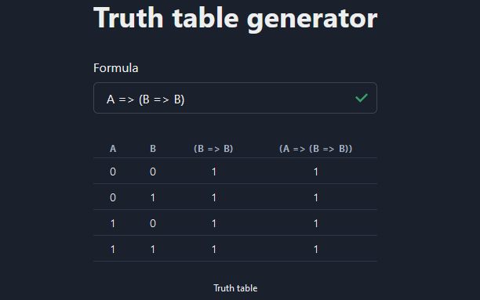

# Truth Table Generator

## About The Project

I have created this project just for fun to get acquainted with React and [Parser Combinator](https://en.wikipedia.org/wiki/Parser_combinator).

I have built truth table generator for propositional logic formulas which generates truth table for all possible combinations of the inputs and shows all steps which are performed to solve the formula.

    

## Built With

-   [Next.js](https://github.com/vercel/next.js/)
-   [React](https://github.com/facebook/react)
-   [Chakra UI](https://github.com/chakra-ui/chakra-ui)
-   [Arcsecond](https://github.com/francisrstokes/arcsecond)

## Usage

The parser is strongly typed and does not support formulas which consist of two or more operands without putting them in brackets.

### Supported operators

-   AND - &&
-   OR - ||
-   XOR - ^
-   NOT - ~
-   Implication - =>
-   Equivalence - <=>

### Examples

<pre>
A && (B && A)
~(A && B)
</pre>
